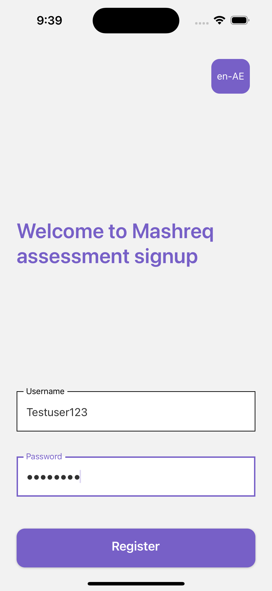
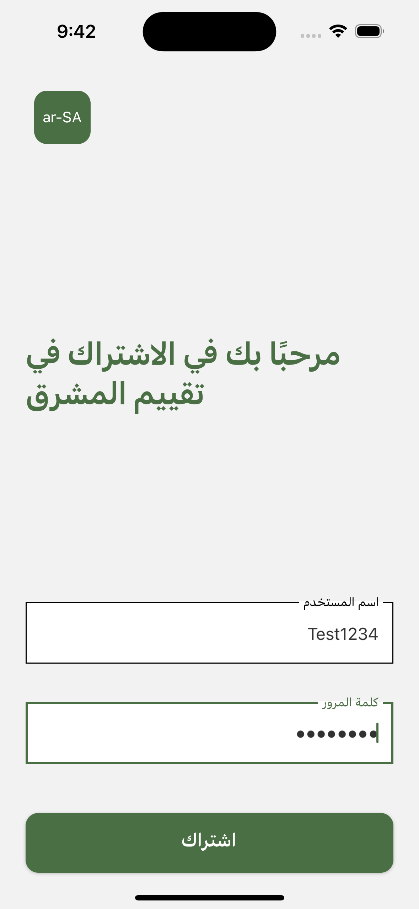

# AssessmentMobile

The app allows the user to signup to the portal using their username & password. Each region has specific username validation rules.

Regions:

1. UAE
2. India
3. Saudi Arabia
4. Egypt

Languages:

1. English
2. Arabic
3. Hindi

### A look inside!






## Getting Started

Follow the below instructions to set up and run the app on your local machine.

### Prerequisites

- [Node.js](https://nodejs.org/) (v16.0)
- [Yarn](https://yarnpkg.com/)

### Installing

1. Clone the repository:

```bash
git clone https://github.com/nikhilc94/AssessmentMobile.git
```

2. Navigate to the project folder:

```bash
cd AssessmentMobile
```

3. Install dependencies:

```bash
yarn install
```

### Running the App

1. To run the app on your local machine, use the following commands:

```bash
yarn start
```

2. Navigate to the ios folder and install pods

```bash
cd ios
```

```bash
pod install
```

3. To run the app in iOS

Open the ios workspace in Xcode and run the build.

or

```bash
yarn ios
```

4.  To run the app in Android

```bash
yarn android
```
